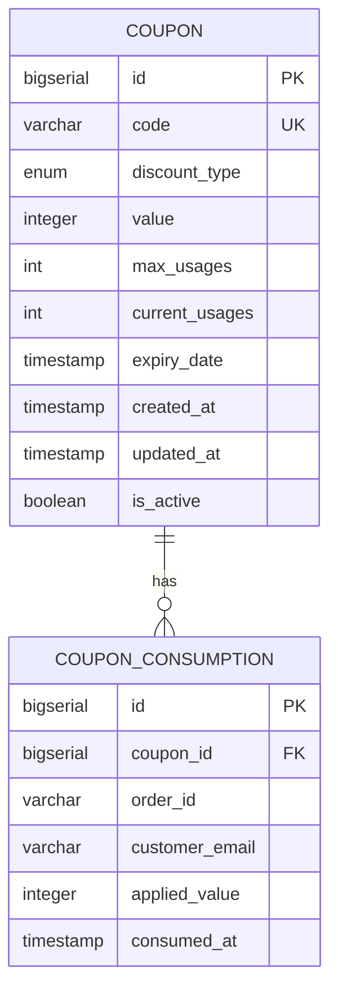

# Coupon-API

## ERD Diagram

```mermaid
erDiagram
    COUPON {
        bigserial id PK
        varchar code UK
        enum discount_type
        integer value
        int max_usages
        int current_usages
        timestamp expiry_date
        timestamp created_at
        timestamp updated_at
        boolean is_active
    }

    COUPON_CONSUMPTION {
        bigserial id PK
        bigserial coupon_id FK
        varchar order_id
        varchar customer_email
        integer applied_value
        timestamp consumed_at
    }

    COUPON ||--o{ COUPON_CONSUMPTION : "has"
```